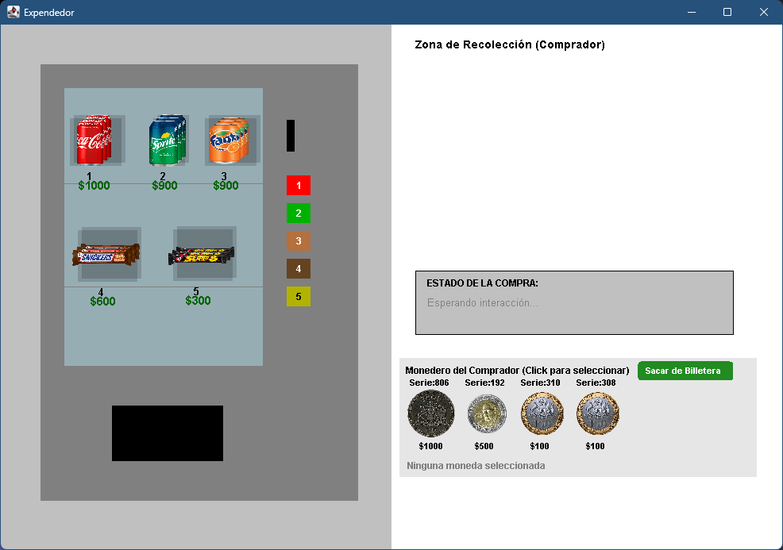

# Máquina Expendedora con Interfaz Gráfica
#### Tarea N°3 Desarrollo Orientado a Objetos por el Grupo 9

## Integrantes del Grupo
* Joaquín Adauy - 2025405466
* Joaquín Navarrete - 202542012
* Vicente Vergara - 2025431734
---
## Diagrama UML
A continuación se peresenta el modelo UML de la nueva Máquina Expendedora:

### [Haz clic aquí para ver el Diagrama UML](diagrama_uml.png)

---
## Captura de Pantalla  Funcionamiento

